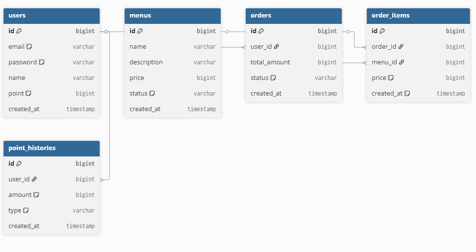

# CafeBackendProject

***

위 프로그램은 스프링 부트, 레디스, 카프카를 활용하여 구축된 백엔드 API 서버입니다.

***

# 프로젝트 개요

목적 : 포인트 결제 및 실시간 데이터 전송을 보장하는 백엔드 주문 API 서버 구축

### 핵심 목표
- Redis를 이용한 결제 동시성 제어
- Kafka를 활용한 주문 데이터 비동기 전송

### 기술 스택 
- Framework : Spring Boot 4.0.5
- Database : MySQL + Redis
- MessagePassing : Kafka

### 폴더 구조

***

# 1. 문제 해결 전략 수립 (보충 예정)

## 왜 Redis인가?

서버가 다수의 인스턴스로 스케일 아웃(Scale-out)된 환경에서는 동일한 사용자가 여러 기기에서 동시에 결제나 충전을 시도할 때 데이터 손실이 발생할 수 있습니다. 이를 방지하기 위해 분산 환경을 아우르는 동기화된 Lock 메커니즘이 필수적이었습니다.

비관적 락(Pessimistic Lock)의 한계: DB 레벨에서 락을 점유하므로 정합성은 확실하나, 트래픽 집중 시 DB 커넥션 풀 고갈 및 전체 시스템 병목을 유발합니다.

낙관적 락(Optimistic Lock)의 한계: 충돌이 발생하면 애플리케이션 단에서 재시도(Retry) 로직을 처리해야 하므로, 결제가 빈번한 시스템에서는 리소스 낭비가 심해집니다.

선택 이유 (Redis 분산 락): 인메모리 기반으로 I/O 속도가 압도적으로 빠른 Redis를 도입하여 메인 DB의 부하를 최소화했습니다.

## 왜 Kafka인가? 

HTTP 동기 통신의 한계: 주문 로직 내부에서 HTTP 통신을 사용할 경우, 외부 서버의 응답 지연이나 장애가 우리 서버의 '주문 실패' 및 '스레드 고갈'로 직결되는 문제가 발생합니다.

선택 이유 (Kafka 비동기 통신): 메시지 브로커인 Kafka를 도입하여 주문 서버는 메시지 발행만 담당하도록 시스템 결합도를 분리했습니다. 수집 플랫폼에 장애가 발생해도 주문은 정상적으로 처리되며, 향후 마케팅/알림 등 타 도메인에서 결제 데이터를 필요로 할 때 기존 로직 수정 없이 토픽만 사용하면 되므로 확장성이 매우 뛰어납니다.
***

# 2. ERD



# 3. API 명세서

### [Auth API]

회원가입 API

설명 : ```신규 사용자의 정보를 받아 데이터베이스에 등록합니다.```

Method: ```POST```

Endpoint: ```/auth/signup```

로그인 API

설명: ```이메일과 비밀번호를 검증한 후, 인증된 사용자에게 다른 API 호출 시 사용할 수 있는 토큰을 발급합니다.```

Method: ```POST```

Endpoint: ```/auth/login```

로그아웃 API

설명: ```사용자의 현재 토큰을 만료시켜 더 이상 해당 토큰으로 API를 호출할 수 없도록 막습니다.```

Method: ```POST```

Endpoint: ```/auth/logout```

***

### [Point API]

내 포인트 확인 API

설명 : ```나의 현재 보유 포인트 잔액을 조회합니다.```

Method: ```GET```

Endpoint: ```/users/point```

내 포인트 충전 API

설명 : ```특정 사용자의 포인트를 충전하고 결제 금액만큼 잔액을 증가시킵니다.```

Method: ```PATCH```

Endpoint: ```/users/point/charge```

내 포인트 내역 확인 API

설명 : ```특정 사용자의 포인트 충전과 차감 이력을 조회합니다.```

Method: ```GET```

Endpoint: ```/users/point/histories```

***

### [Menu API]

커피 메뉴 등록 API

설명 : ```새로운 커피 메뉴의 이름과 가격 정보를 시스템에 등록합니다.```

Method: ```POST```

Endpoint: ```/menus```

커피 메뉴 조회 API

설명 : ```전체 커피 메뉴 목록과 가격 정보를 조회합니다.```

Method: ```GET```

Endpoint: ```/menus```

커피 메뉴 수정 API

설명 : ```등록된 특정 커피 메뉴의 정보(이름, 가격 등)를 수정합니다.```

Method: ```PUT```

Endpoint: ```/menus/{menuId}```

커피 메뉴 삭제 API

설명 : ```특정 커피 메뉴를 시스템에서 판매 중지 처리합니다. Soft Delete 예정```

Method: ```DELETE```

Endpoint: ```/menus/{menuId}```

인기 메뉴 확인 API

설명 : ```최근 주문 횟수가 가장 많은 인기 메뉴 목록을 조회합니다.```

Method: GET

Endpoint: ```/menus/populer```

***

### [Order API]

커피 주문 생성 API

설명 : ```사용자가 선택한 커피 메뉴들로 새로운 주문을 생성합니다.```

Method: ```POST```

Endpoint: ```/orders```

커피 주문 전체 조회 API

설명 : ```모든 사용자의 전체 주문 내역을 조회합니다. ```

Method: ```GET```

Endpoint: ```/orders```

주문 상태 변경 API

설명 : ```특정 주문의 진행 상태(결제 완료, 제조 중, 제조 완료 등)를 업데이트합니다.```

Method: ```PATCH```

Endpoint: ```/orders/{orderId}/status```

내 주문 내역 조회 API

설명 : ```나의 과거 주문 내역 및 결제한 상세 메뉴 정보를 조회합니다.```

Method: ```GET```

Endpoint: ```/users/orders```

결제 API

설명 : ```주문 금액만큼 나의 포인트를 차감하여 결제를 진행하고, 성공 시 주문 내역을 데이터 플랫폼(Kafka)으로 실시간 전송합니다.```

Method: ```POST```

Endpoint: ```/orders/payment```

